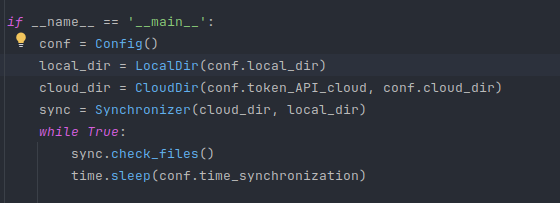
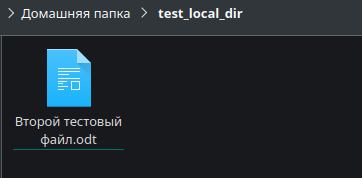
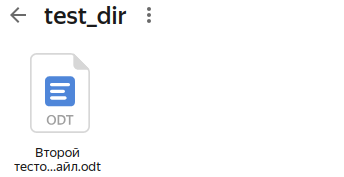
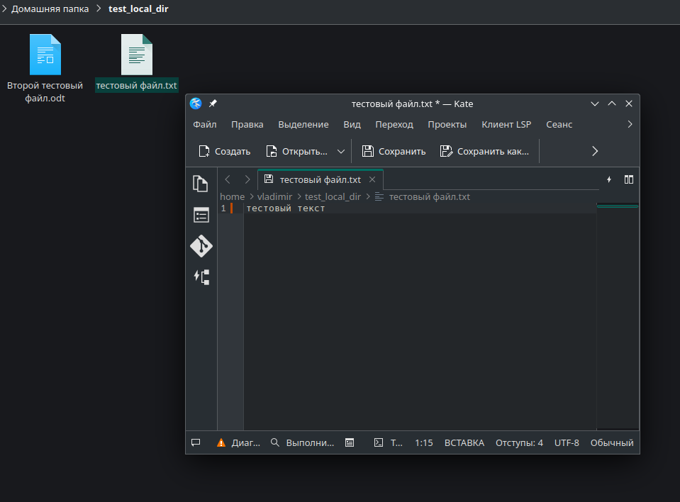
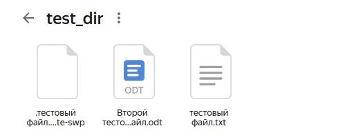
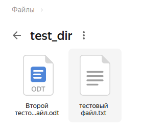
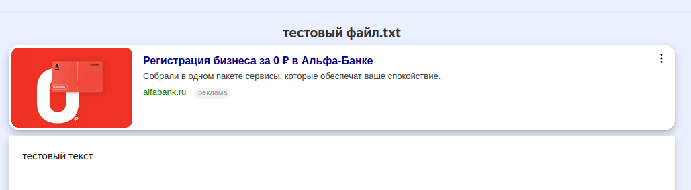

# Синхронизатор файлов
Этот проект предназначен для синхронизации файлов локальной директории с облачным хранилищем. 
В данном проекте используется Яндекс диск.

## Содержание
- [Технологии](#технологии)
- [Использование](#использование)
- [Начало работы](#начало-работы)
- [Пример работы](#пример-работы)
- [Контакты](#контакты)

## Технологии
- [Requests](https://docs-python.ru/packages/modul-requests-python/)
- [python 3.12](https://docs.python.org/3/)
- [API token](https://yandex.ru/dev/disk-api/doc/ru/concepts/quickstart)

## Использование
Перед запуском программы необходимо заполнить config.ini, где указаны основные параметры для работы программы

Содержание config.ini:
```ini
[API]
token_API_cloud =  #  Получить токен можно через инструкцию

[logger]
name_log_file = test_log_file  #  Имя файла куда будут записываться логи

[dirs]
name_cloud_dir = test_dir  #  Имя директории в облаке
path_local_dir = /home/vladimir/test_local_dir  #  Путь к локальной папке, которую нужно синхронизировать

[time_synchronization]
time_sec = 300  #  Периодичность синхронизации файлов (в секундах)
```

## Начало работы

### Требования
Для установки и запуска проекта, необходим [python 3.12](https://www.python.org/downloads/).

### Установка зависимостей
Для установки зависимостей, выполните команду:
```sh
pip install -r req.txt
```

### Запуск программы
Чтобы запустить программу, выполните команду:
```sh
python main.py
```

## Пример работы

Содержание main.py:


Содержание локальной папки:



Содержание облачной папки после запуска скрипта:



Содержание нового файла в локальной директории:



Облачная директория с запущенной программой:



Облачная директория после сохранения изменений в локальной директории:



Содержание нового файла в облачной директории:



## Контакты
Оставьте пользователям контакты и инструкции, как связаться с командой разработки.

- [Быков Владимир](https://t.me/ReBiwer) — Back-End Engineer
